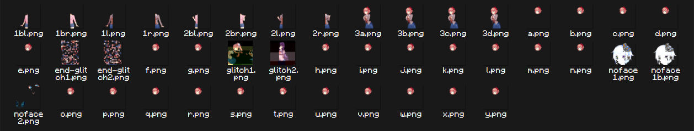

A visual novel/dating sim built in [LÖVE](https://love2d.org/) and styled after [PICO-8](https://www.lexaloffle.com/pico-8.php).

  
See also: Sleep-Deprived Programmer Ramblings

  
  > TLDR: *In a Heartbeat* literally became too big for PICO-8, so I moved it into another game engine.

  *In a Heartbeat* actually runs in [LÖVE](https://love2d.org/), "an awesome 2D game framework for Lua."
  > Lua is the same programming language that PICO-8 and Roblox Studio use for code.
  It's also the programming language that I'm the most familiar with.
  
  This is due to the fact that PICO-8 cartridges, among other limitations, have a fixed character limit of 65,535.
  This also includes shared files that are copied into the cartridge on launch.
  
  In pre-LÖVE *In a Heartbeat*, one of these shared files was `images.lua`. It contained all of the game's backgrounds and portraits.
  The thing is, those images were all stored as giant strings of text averaging at 1,300 characters each.
  Having **34** of these "image strings" ended up using over *half* of the character limit.
  
  
  So imagine my face when I booted the cartridge and PICO-8 told me that I couldn't `#INCLUDE` `renp8.lua` because I was over the character limit...
  
  Now, there exists a tool called [Shrinko8](https://github.com/thisismypassport/shrinko8/) that can take a PICO-8 cartridge and strip away as many unnecessary characters as possible.
  
  So I gave it *In a Heartbeat*....
  
  
  
  Yeah...
  
  So I went looking for ways to get around the character limit.
  
  Enter [PICOLOVE](https://github.com/picolove/picolove), "an implementation of PICO-8's API in LÖVE."
  
  It... kinda worked.
  It's a bit janky, it's missing some crucial PICO-8 commands, and worst of all, it requires LÖVE **0.10.2**.
  For context, the latest release is **11.5**.
  
  So I scrapped it, and decided to "recreate" PICO-8 in LÖVE.
  
  > This will make a bit more sense after you beat the game.
  
  Canonically, *In a Heartbeat* runs in PICO-8. Again, the only reason it doesn't is because of the stupid character limit, and *In a Heartbeat* could *theoretically* run in PICO-8 just fine.
  I'm just too lazy to find out how to trim it down.
  
  Besides, doing it in LÖVE made programming, debugging, and editing 1,000,000x easier.
  
  ---
  As a side note, before I dropped PICOLOVE, I was adding in the missing functions.
  While testing, I learned that LÖVE **really** hates any strings that contain "%" at all.
  
  And, image strings contain plenty of those.
  So, I also dropped image strings, in favor of `.png` files.
  
  This not only solved the random crashes, but also allowed me to use *Doki Doki Literature Club!*-style portraits.
  
  That is, *Doki Doki Literature Club!* stores portraits as a left half, a right half, and a head.
  
  
  
  And, to make my life **way** easier, [DDLC-LOVE](https://github.com/LukeZGD/DDLC-LOVE/), a remake of *Doki Doki Literature Club!* in LÖVE, already did the drawing for me.
  In fact, it's basically a perfect visual novel engine, coded in a language that I'm **extremely** fluent in.
  So I stole it.

  As in, I took the game's code, removed all of the *Doki Doki Literature Club!*-specific bits, and added in some *In a Heartbeat*-specific bits.
  
  So technically, *In a Heartbeat* is a *Doki Doki Literature Club!* mod. Only, it's coded in Lua instead of Ren'Py.
  > I really should've gone with Ren'Py from the start...
  

---

# Controls

The controls are based off of PICO-8's default keybinds, with a few differences:

Keyboard          | Controller | Action
------------------|------------|----------------------------------------
Space/X/V/M       | A/Y        | Dismiss dialogue, select menu item
H/Backspace/Z/C/N | B/X        | Toggle UI visibility, close PICO-8 menu
Esc/P/Enter       | Start      | Open PICO-8 menu
Arrows            | D-Pad      | Scroll history, menuing

These buttons do nothing in any other context.

<!-- > [!IMPORTANT]
> Playing on Android requires connecting a controller via Bluetooth or USB.
> *In a Heartbeat* does **not** have touchscreen support. -->

# Key Info

> [!IMPORTANT]
> *In a Heartbeat* can only run on Windows and MacOS. Sorry, everyone else!
<!-- > *In a Heartbeat* can only run on Windows, MacOS, Android, and 3DS. Sorry, Linux and iOS users! -->

Just like *Doki Doki Literature Club!*, *In a Heartbeat* isn't over until the credits are finished.

Files are stored in different locations depending on platform.
Usually, it's the default PICO-8 directory, but it can vary.

OS      | Location
--------|---------------------------
Windows | %appdata%\pico-8
MacOS   | Application Support/pico-8

> [!CAUTION]
> I swear to zep, if this game turns you on, *shit will go down*.

---
Fun fact: In short, "doki-doki" is the sound of your heartbeat in Japanese.

Yes, apparently thumping isn't international.
> That's what she said.

This is where both *Doki Doki Literature Club!* and *In a Heartbeat* get their names.
It is also why me and Dan Salvato much, much prefer saying "DDLC" instead of "Doki Doki."

# Installation
<!-- ## Windows/MacOS -->
Download the latest release of *In a Heartbeat* for your operating system from the "Releases" tab.

Simply extract the `.zip` to a folder located somewhere accessible, like your Desktop.
  
Then, run the `iah` application.
<!-- ## Android
### Coming soon!
Download `iah.apk` from the "Releases" tab.

Run it to install the game as an app.

> [!IMPORTANT]
> As *In a Heartbeat* is not from Google Play, you may need to grant permission for the `.apk` to install.
## 3DS
### Coming soon!
> [!IMPORTANT]
> Installing *In a Heartbeat* on a 3DS requires Luma3DS. For more information, visit [3DS Hacks Guide](https://3ds.hacks.guide).

Scan this QR code using FBI's "Remote Install":

Alternatively, you can download `iah.cia` from the "Releases" tab and transfer it to your SD card. -->

# Credits

 
Spoilers ahead!

Role           | People
---------------|-------------------------------------------------------------------------
Writing        | imaiden_B, Hyruliam
Art            | imaiden_B, Luka
Music          | imaiden_B, Liquidream, C418, Junichi Masuda, Jonathan Coulton
Special Thanks | ItzOof, RedLookingSus, zep, AetherDrawzs, LukeZGD, Team Salvato, Spencer

